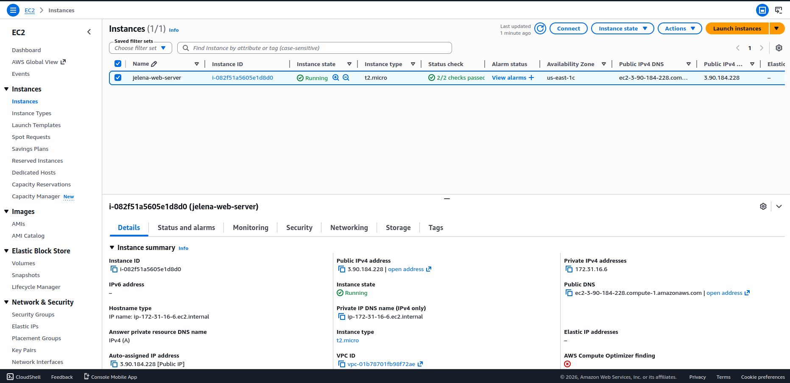
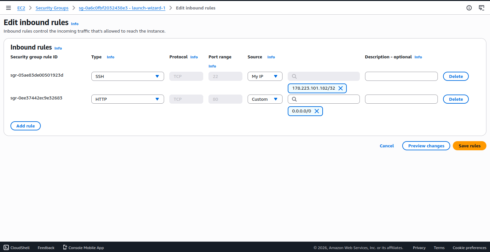
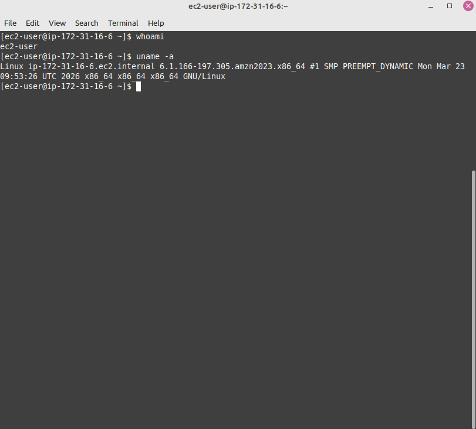
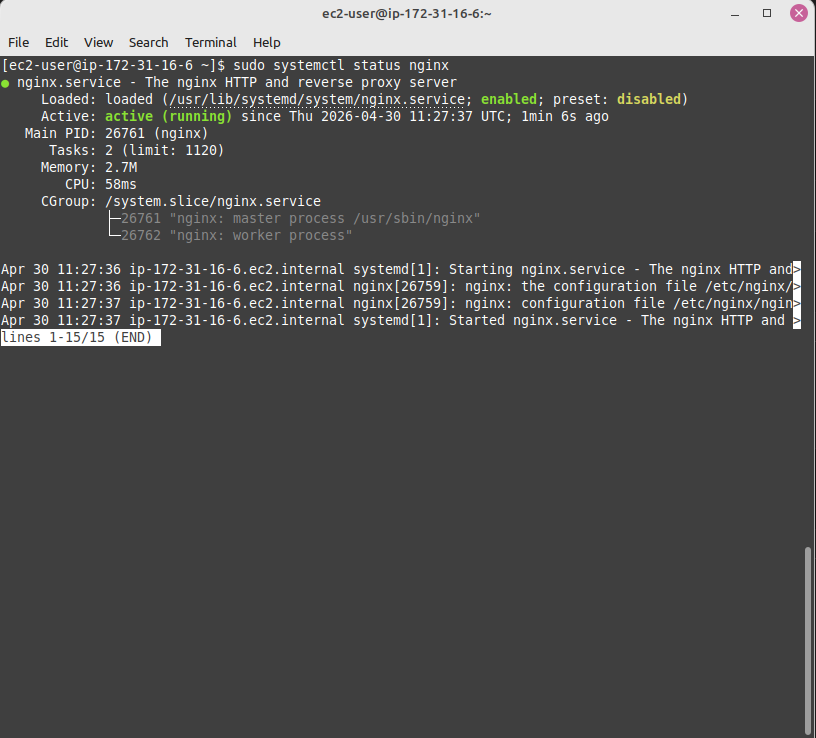
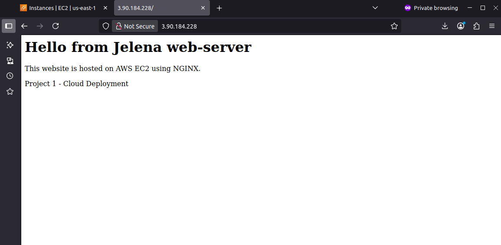
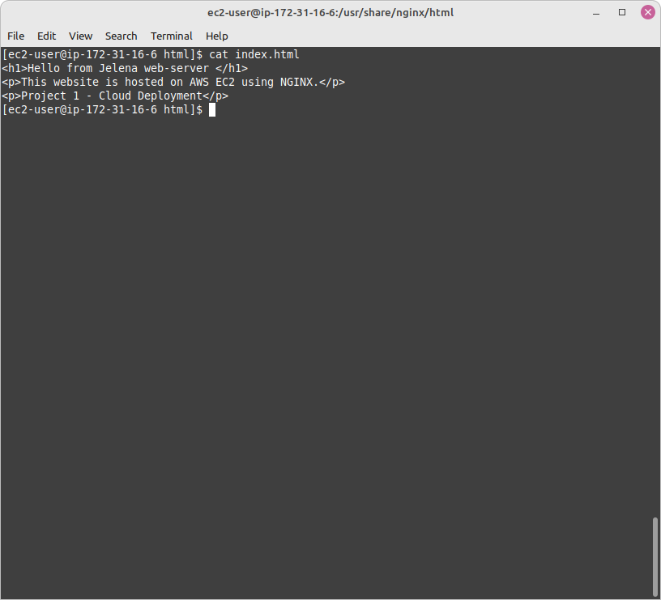
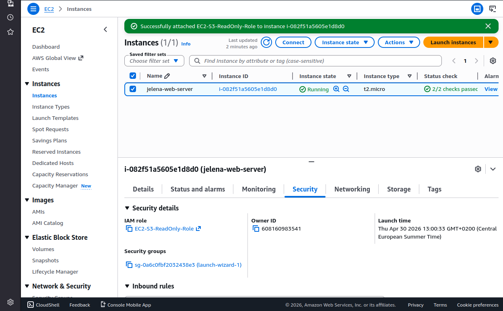

# AWS EC2 NGINX Web Server Deployment

## Overview
This project shows the deployment and configuration of a Linux-based web server on AWS EC2 using NGINX. 
It includes instance setup, secure access configuration, and basic IAM role usage. 

A simple Bash script is also included to automate the web server setup.

---

## Architecture
- Amazon EC2 (Amazon Linux) 
- NGINX web server 
- Security groups (SSH and HTTP access) 
- IAM role (read-only access to S3) 

---

## Configuration Steps

### 1. EC2 Setup
- Launched an Amazon Linux EC2 instance 
- Configured security group rules to allow:
  - SSH (port 22) 
  - HTTP (port 80) 

---

### 2. SSH Access
- Connected to the EC2 instance using SSH with a key pair 

---

### 3. NGINX Installation
- Installed NGINX using the package manager (`yum`) 
- Started the NGINX service 
- Enabled the service to start on boot 

---

### 4. Web Deployment
- Deployed a custom HTML page to: 
  `/usr/share/nginx/html` 

---

### 5. IAM Role
- Attached an IAM role to the EC2 instance 
- Configured read-only access to S3 without using access keys 

---

## Automation Script

A Bash script (`setup.sh`) is included to automate the installation and configuration process.

### Script Actions
- Updates system packages 
- Installs NGINX 
- Starts and enables the service 
- Deploys a sample HTML page 

### Usage

```bash
chmod +x setup.sh
./setup.sh
```

---

## Screenshots
The following screenshots show key steps and results of the deployment process.

### EC2 Instance Running

 
### Security group configuration 


### SSH connection 


### NGINX status 


### Website in browser 


### HTML file


### IAM role 


---

## Key Skills Demonstrated
- Linux server setup and basic administration 
- AWS EC2 instance provisioning 
- NGINX installation and configuration
- Security group configuration (SSH and HTTP access)
- IAM role usage for secure access to AWS services
- Basic Bash scripting for automation 

---

## Author
Jelena
